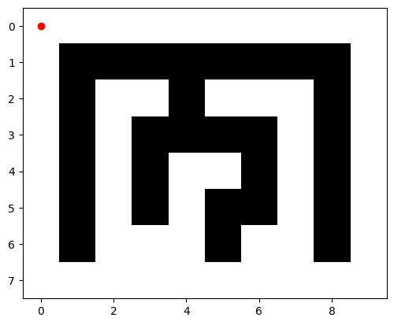
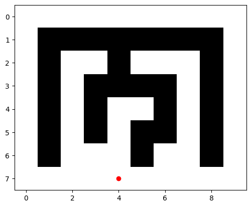

# visualmazesolver
This script solve mazes and visualizes them

## This code is written by ChatGPT

Starting Point:

Ending Point:

https://user-images.githubusercontent.com/54573938/205468516-0e80b062-140e-40b3-8c35-02b3e5a4dd35.mp4

